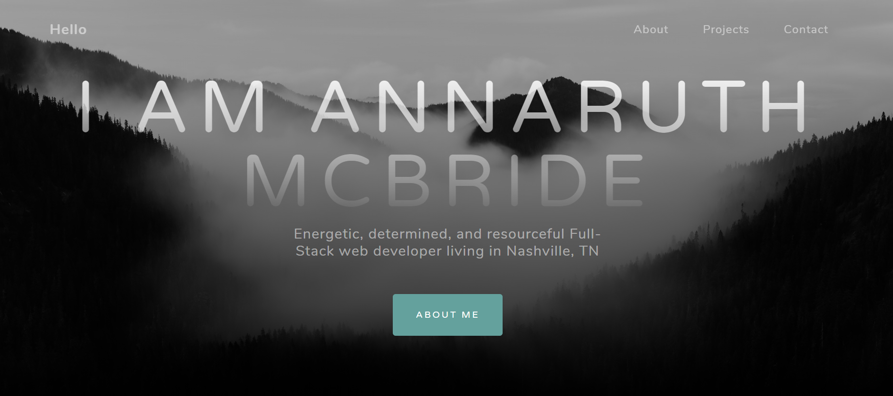

  <h1 align= "center">Portfolio</h1> 
  <li>See here: <a href="https://armcbride.github.io" target="blank">https://armcbride.github.io</a></li>
  <h3>Table of Contents<h3>
  <ul>
  <li><a href="#descrip">Description</a></li>   
  <li><a href="#tech">Technology</a></li>  
  <li><a href="#license">License</a></li>
  <li><a href="#screen">Screenshots</a></li> 
  <li><a href="#contr">Contributors</a></li> 
  <li><a href="#quest">Questions</a></li>  
  </ul>
    

  
<h3>Description</h3> 

  My Web Development portfolio
  

  
<h3>Technology</h3>
           
  
 HTML, CSS, JavaScript, Bootstrap

  

  

 
  

  
<h3>Screenshots</h3>

  

  

  
<h3>Contributors</h3> 

  
armcbride
 
  

  
<h3>Questions?</h3> 

           
    Contact: Annaruth McBride       
  <ul>
  <li>Github: <a href= "https://github.com/armcbride">https://github.com/armcbride</a></li>
  <li>Portfolio: <a href= "armcbride.github.io">armcbride.github.io</a></li>
  <li>Email: <a href= "mailto:armcbride17@gmail.com">armcbride17@gmail.com</a> </li>     
  <li>LinkedIn: <a href= "https://www.linkedin.com/in/annaruthmcbride">https://www.linkedin.com/in/annaruthmcbride</a></li>
  </ul> 
  
